# Community Platform
A full-stack web application that provides a platform for communication between students, faculty, administration and alumni.\
\
Implemented a decision tree classifier to classify posts in discussion forums as hateful, offensive, and normal ensuring that the content on the website is clean and moderated.\
\
Tech stack - MongoDB, Express.js, ReactJS, Node.js, Python(Flask, Scikit-learn)\
\
* Community Platform eliminates the need for various social media platforms by providing a single platform which allows students, faculty and administration to interact with each other.​

* Students can view all college related announcements and circulars. 

* Students can post questions as well as answer them in the discussion forums .​

* Information related to future opportunities and career guidance can be shared with all the users.​

* There are 3 different types of users with different levels of access:
    * Admin : Can view add Faculty, view users and delete any user if required.
    * Faculty : Can post announcements and opporunities for students
    * Student : View announcements and opportunities and also interact with othher students in Discussion Forums.
### Images
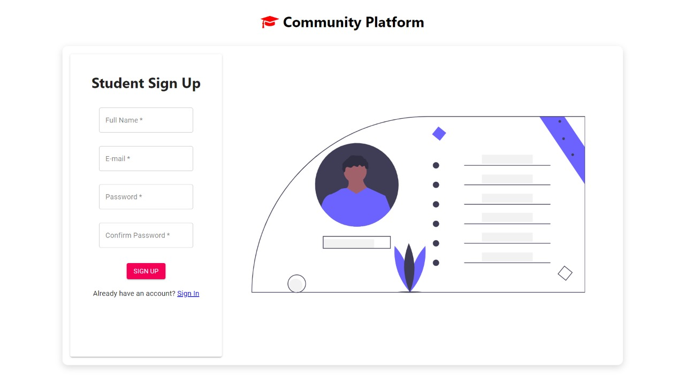
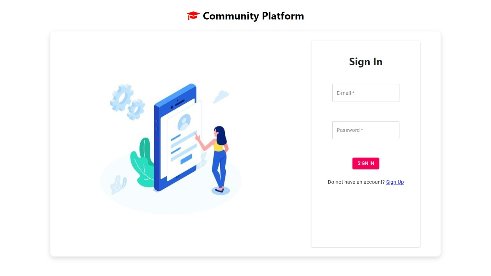
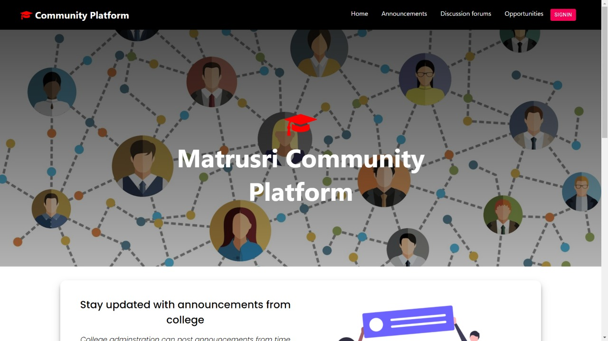
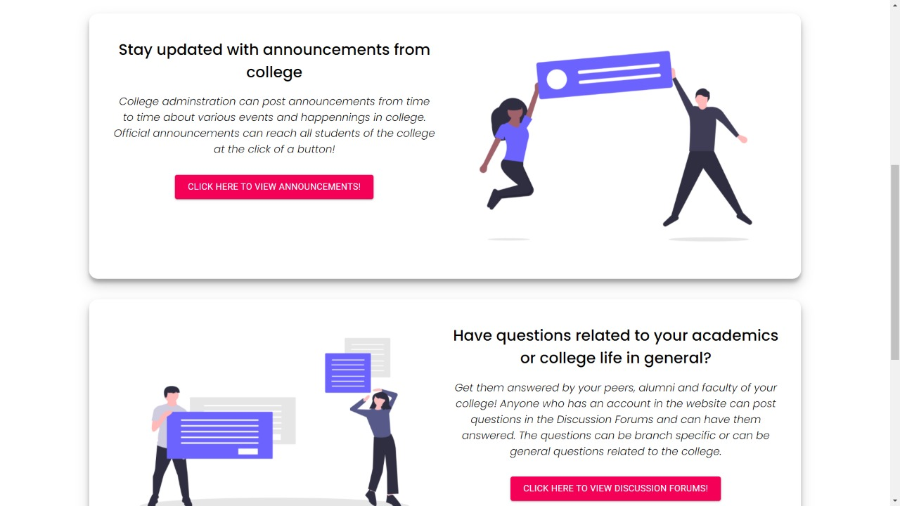
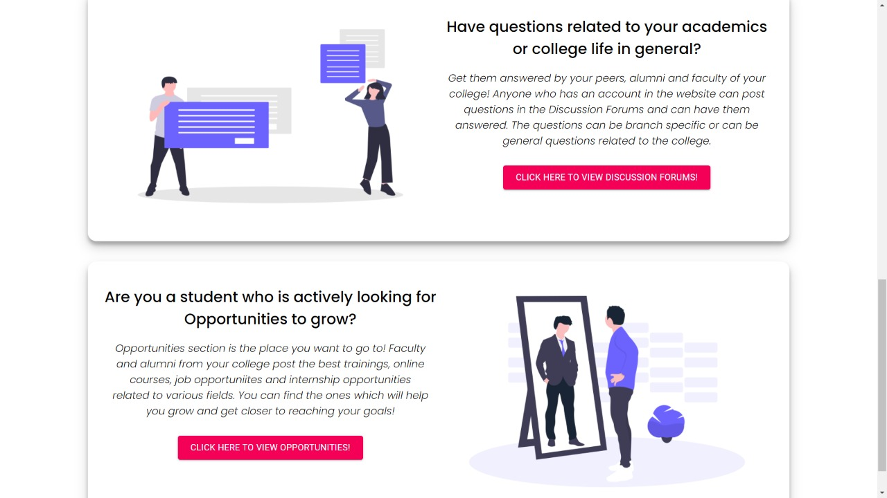
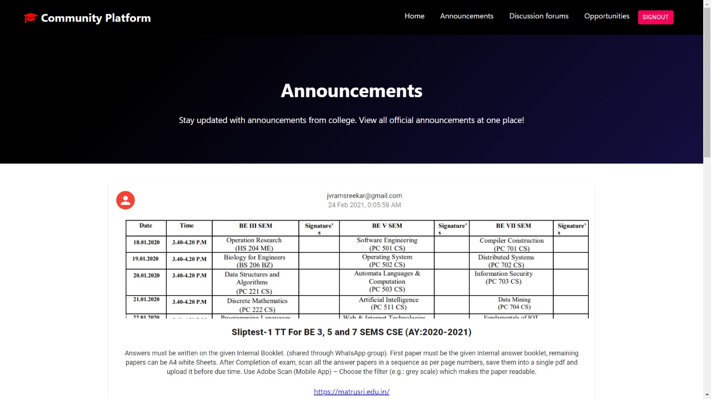
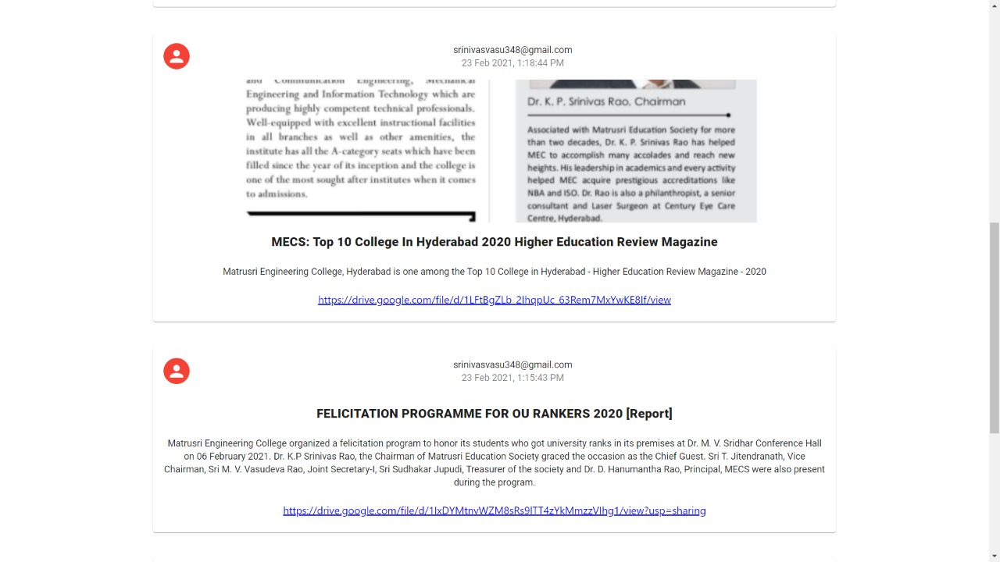
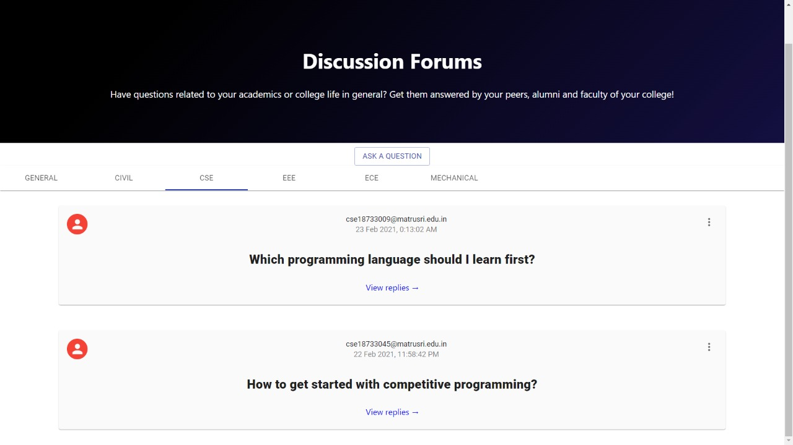
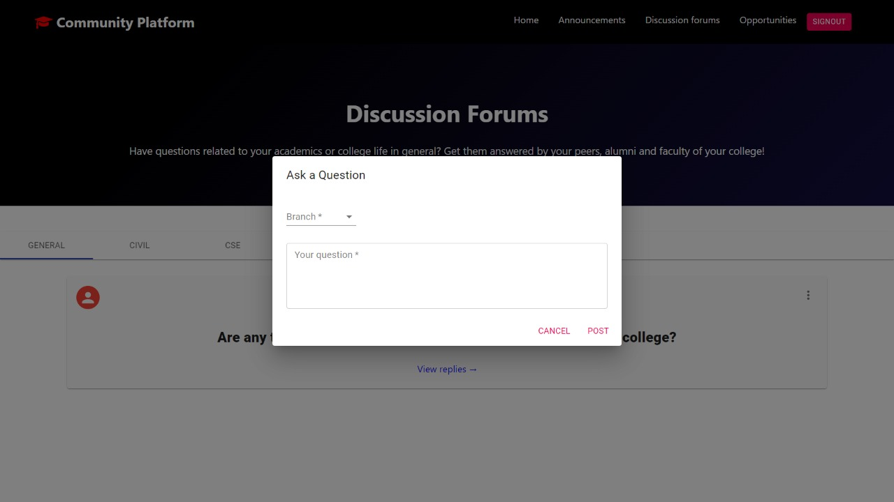
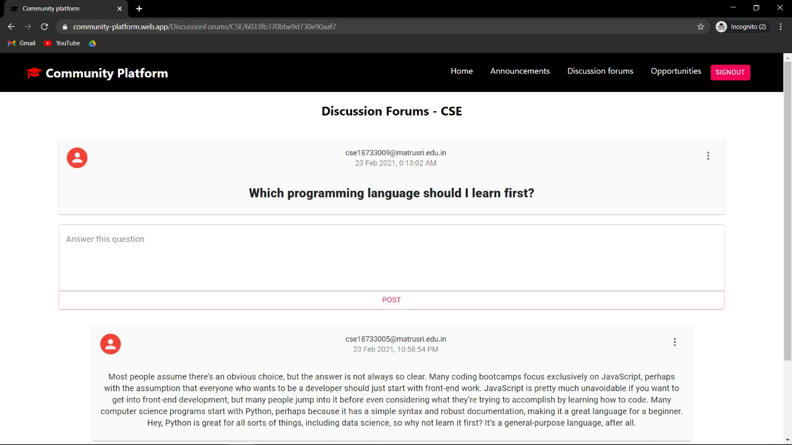
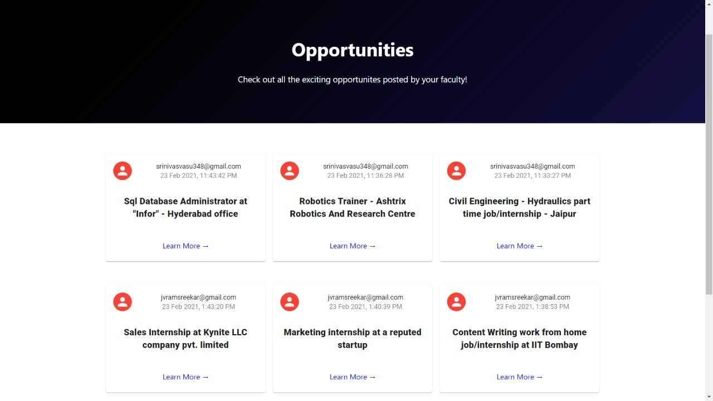
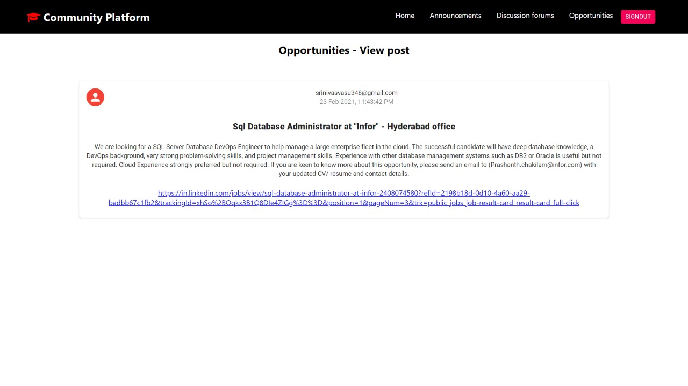
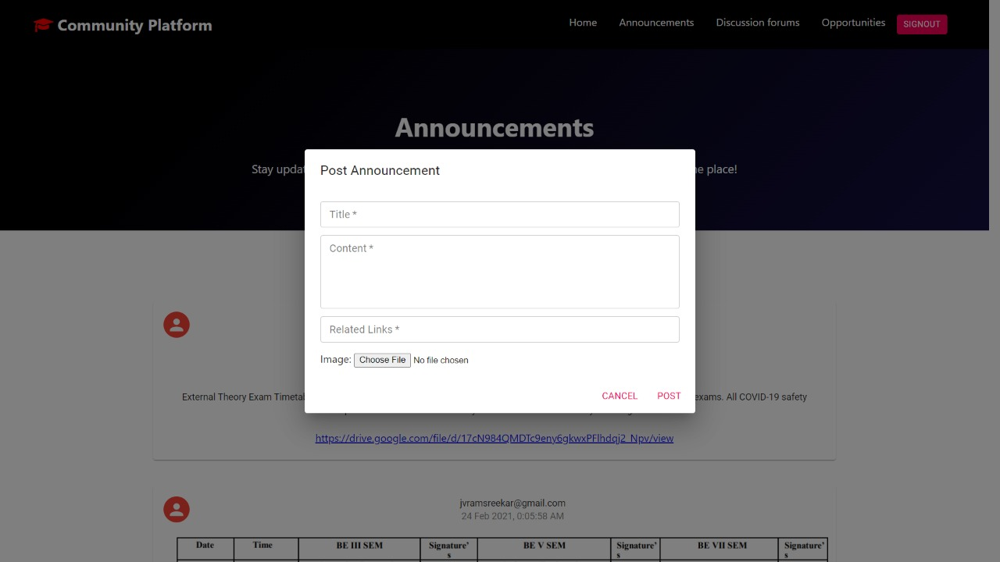
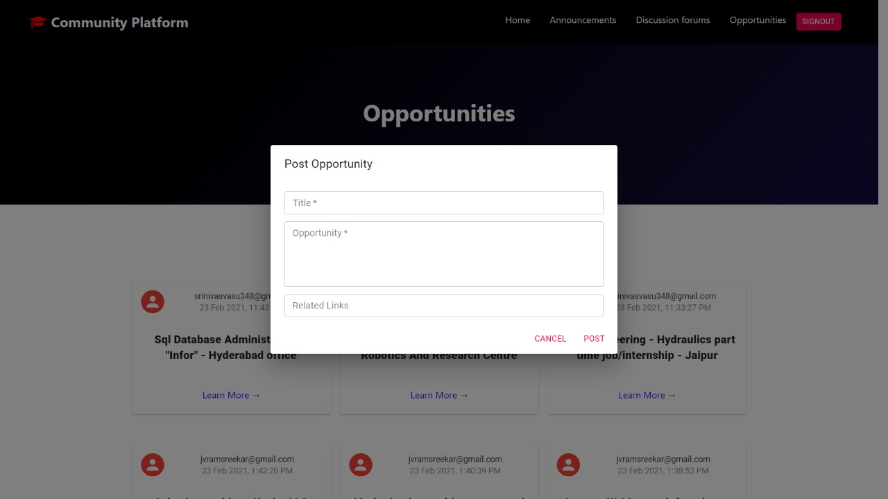
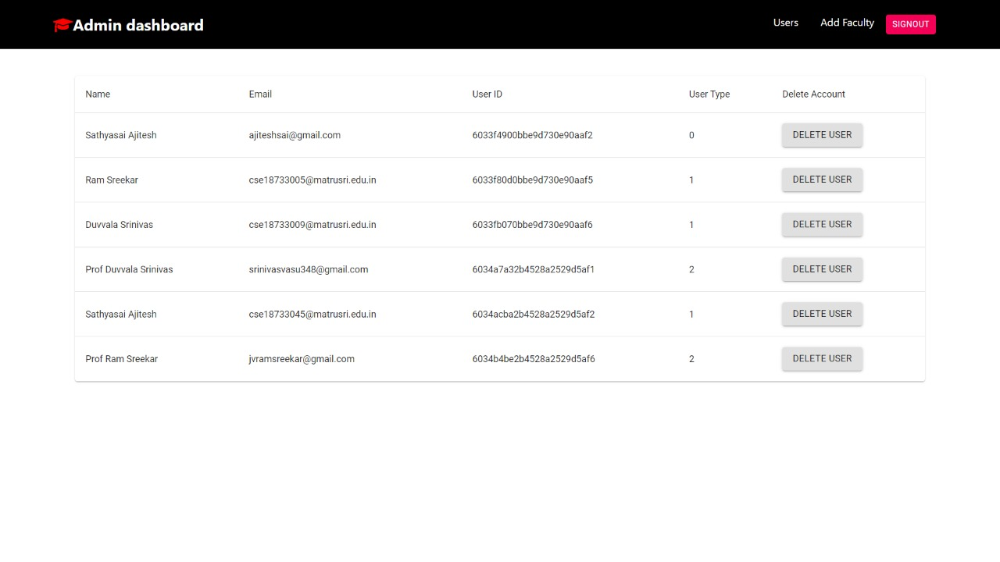
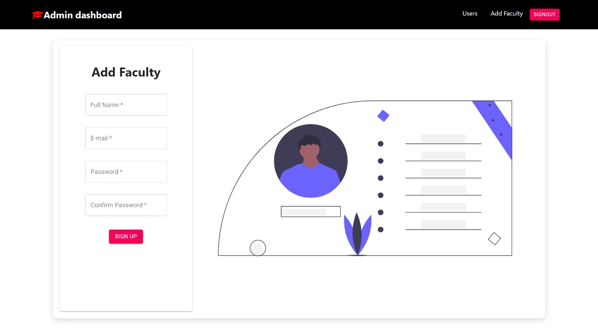
